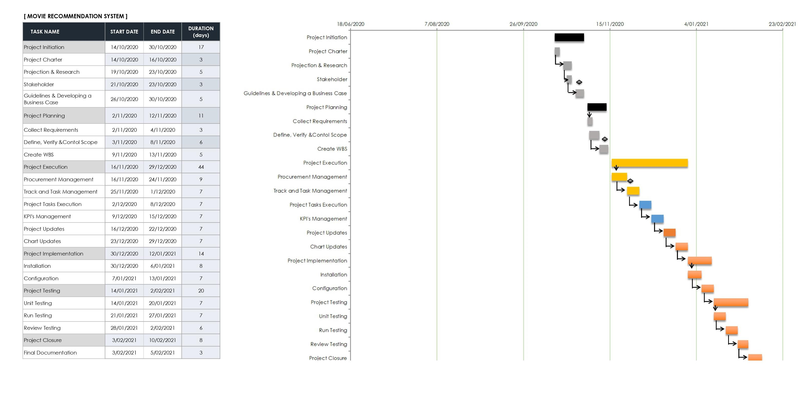

## B. PLANNING THE PROJECT

### Project Management Life Cycle 
Gantt Chart is used to represent the Project Management Life Cycle. For our AI project, we used Microsoft Excel to illustrate a Gantt Chart.

The image below is WBS and Gantt Chart of our project:

