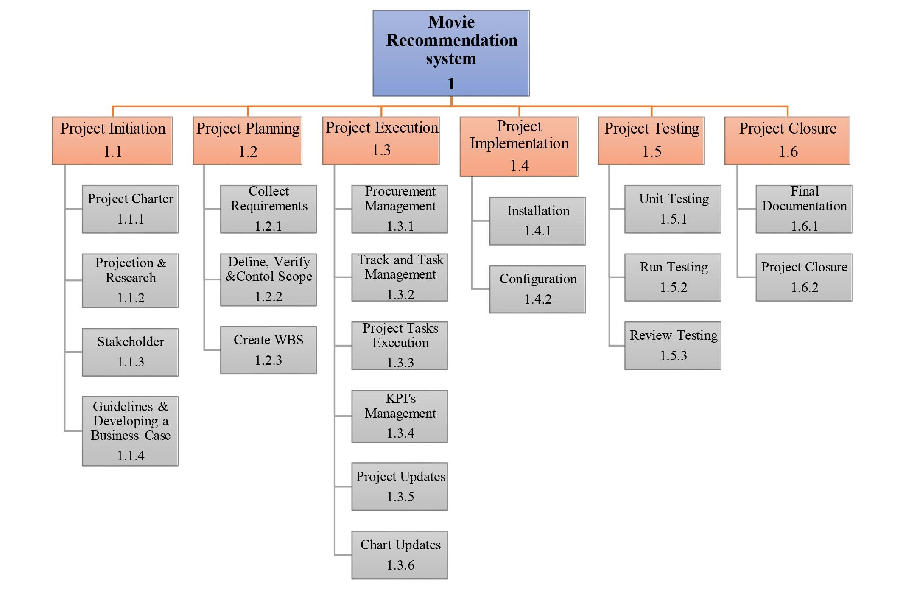
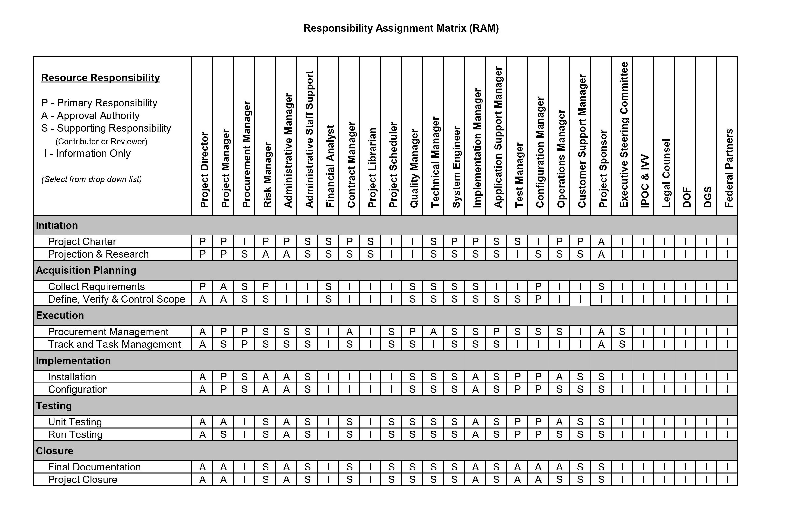

## B. PLANNING THE PROJECT

### Project Management Life Cycle 
Gantt Chart is used to represent the Project Management Life Cycle. For our AI project, we used Microsoft Excel to illustrate a Gantt Chart.

The image below is WBS and Gantt Chart of our project:

### Risk Identification Chart 

| Control Element | What is likely to go wrong? | How and when will I know? | What will I do about it? |
|-----|------|-------|-----|
|Quality|The system will suggests movie incorreclty based on the rating| In few movies, the rating of movies are low. Meanwhile, the low rated movie will be suggested to the users.It can be identified during the testing phase.|Will notify to Test Manager.|
|Cost|The project cost will exceeds the budget.|The project cost will increase when the budget not planned well or took longer time to complete the project. Usually, it will be happen during project implementation. | Monitor the progress and keep stakeholders updated. 
|Time| The project not completed on time. |The project might be delay if goals and objectives are unclear.| Makes sure every team member fully understandS their daily job duties and distractions are not allowed to destroy project timelines.|

### Responsibility Assignment Matrices (RAM)

### Team Members Roles and Responsibilities 

1. SHAMHINIDEVI JAYA BALAN 

| Roles | Responsibilities |
|--------|------------------|
| Project Manager |The project manager is the individual responsible for delivering the project. The individual leads and manages the project team, with authority and responsibility from the project board, to run the project on a day-to-day basis.|
|Technical Manager | The technical manager is a versatile position that requires sufficient managerial skills as well as sufficient technical skills. A technical manager should be able to perform all necessary tasks related to company systems including troubleshooting any technical issues and must oversee the development and implementation of any system through all steps of the process. |
|Risk Manager | The role of a Risk Manager is to communicate risk policies and processes for an organization.  Must provide hands-on development of risk models involving market,credit and operational risk, assure controls are operating effectively, and provide research and analytical support. |

2. ANJCHANAA SEENIVASAGAM 

| Roles | Responsibilities |
|--------|------------------|
| Administrative Manager |Administrative manager oversee the work of other administrative and clerical staff while also providing such duties themselves. Administrative manager help organize schedules, manage payroll and personnel databases, create reports, and offer other clerical duties. This role also requires a significant amount of communication and coordination with other staff and departments, including senior-level officials.|
|Test Manager | The role of the software test manager is to lead the testing team. Test Manager plays a central role in the Team. The Test Manager role is tasked with the overall responsibility for the test effort's success. The role involves quality and test advocacy, resource planning and management, and resolution of issues that impede the test effort. |
|Quality Manager | Quality manager aim to ensure that the product or service an organization provides is fit for purpose, is consistent and meets both external and internal requirements. This includes legal compliance and customer expectations. As a Quality Manager role is concerned with monitoring and advising on the performance of the quality management system, producing data and reporting on performance, measuring against set standards.|
