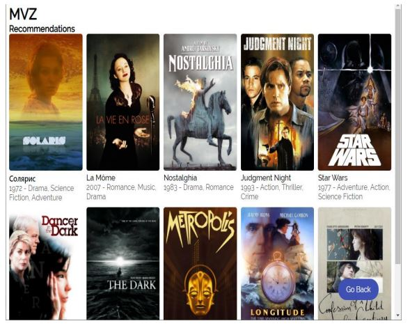
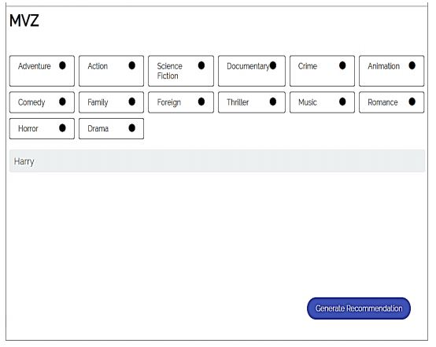
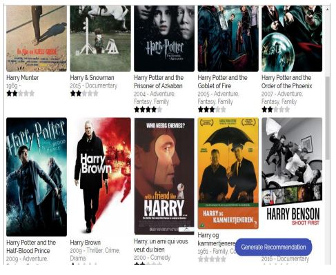
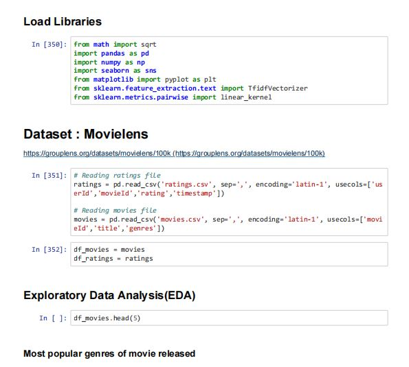
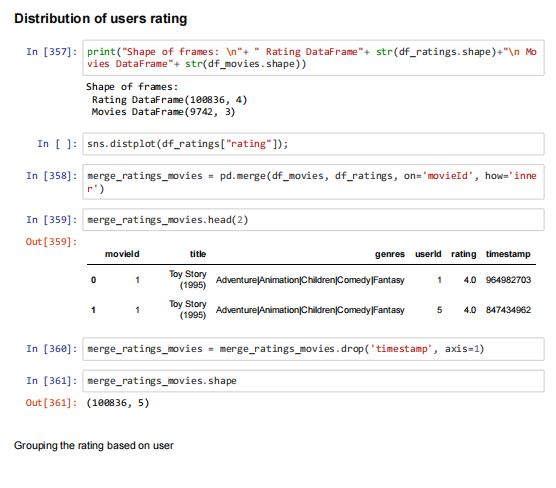
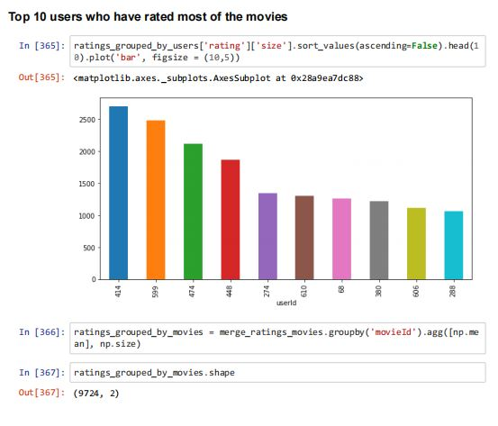
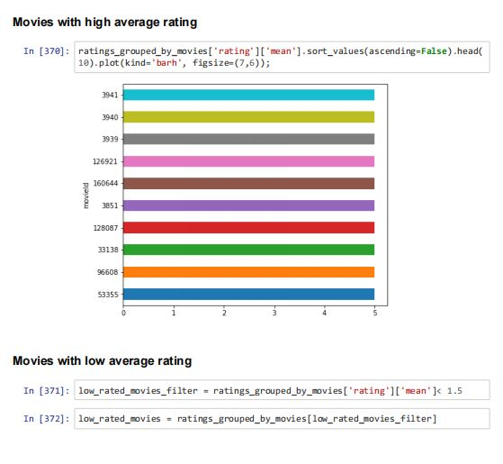
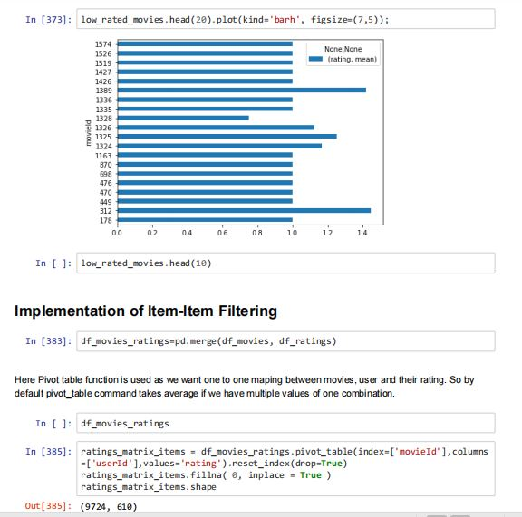
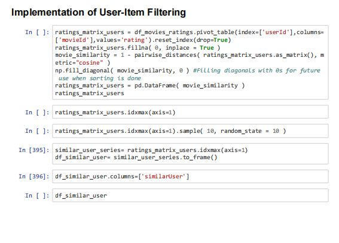

## **Project Design & Result**
#### i. When the user presses the “Generate Recommendation” button it will recommend movies based on his previous ratings. If he/she is a new user and has not rated any movies then they have to search for a random movie or any movie of his interest in the “search” box and rate at least five movies. Then only the “Generate Recommendation” button will be      enabled.

#### ii. If the user is new and has not rated any movies they have to searches for the word, for example ‘Harry’ in the search box and all the movies with ‘Harry’ words will appear on the screen.

#### iii. Then user should rates those movies according to their favourite.The user have to rate at least five movies in order to get recommendations. Once they rates movies, the ‘Generate Recommendations’ button will be enabled until then the button remains disabled. Finally, the system will recommend movies based on the user rating. 

## **Project Coding**

